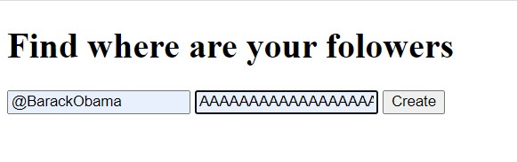

This project contains one module, called followers_map.py. It is the web aplication, the main aim of which -  to create map with 50 Twitter friends of given person. film-locations of given year. 

There are also lots of functions in it, more about them you can find in documantation.

So, when user runs the program, he or she gets the local server ip, then (after clicking on it) the page in brwser loads. On that stage user has ability to put in window screen name of Twitter-user, for which he or she wants to get followers map and bearer token (it is used to get friends list from Twitter). Then user has to waite 1-2 minutes (depends on how much from 50 followers typed their location) and then the map opens.

>>> python followers_map.py

This example will give next map (located in Film_map.html):

Note, that for using this app you should have Twitter bearer token.